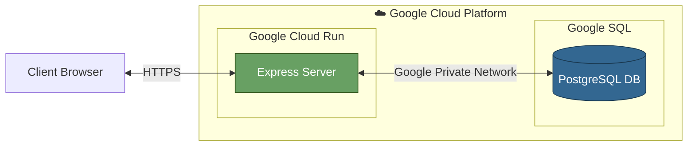
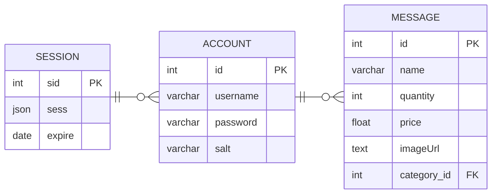

# Members only message board

An exclusive message board where users will only be able to see anonymous messages unless they're authenticated.

## Architecture

The pattern for this system is MVC and we're hosting our application and database on Google Cloud Platform. The server is sitting on a container in Cloud Run and the database on Cloud SQL.

### System Design

### Database Schema

## Installation

After setting the .env variables the project can be ran with
`npm install` then `npm run dev`

## Attributions

CSS reset from [Josh Comeau](https://www.joshwcomeau.com/css/custom-css-reset/)
